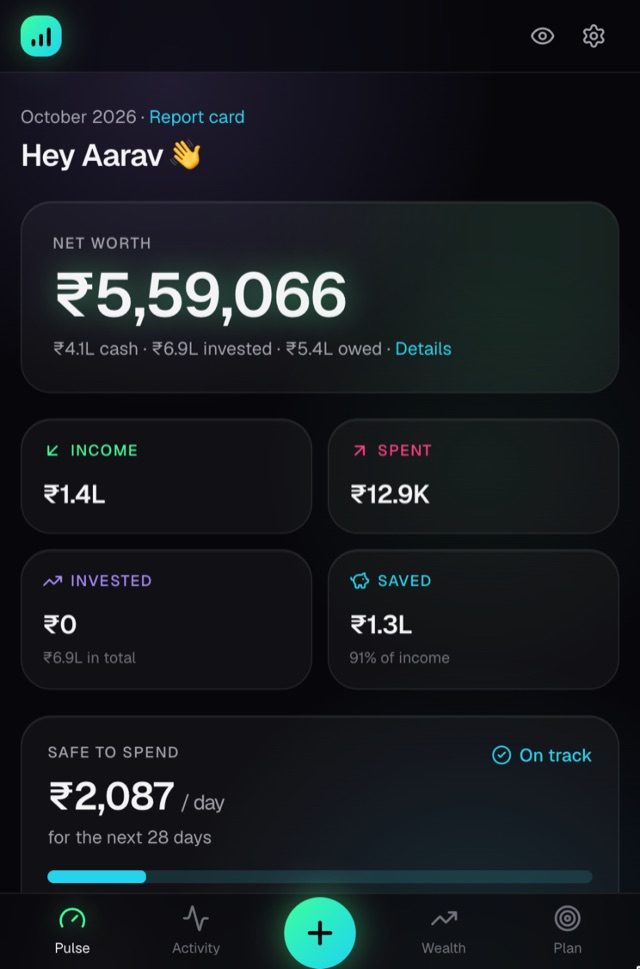
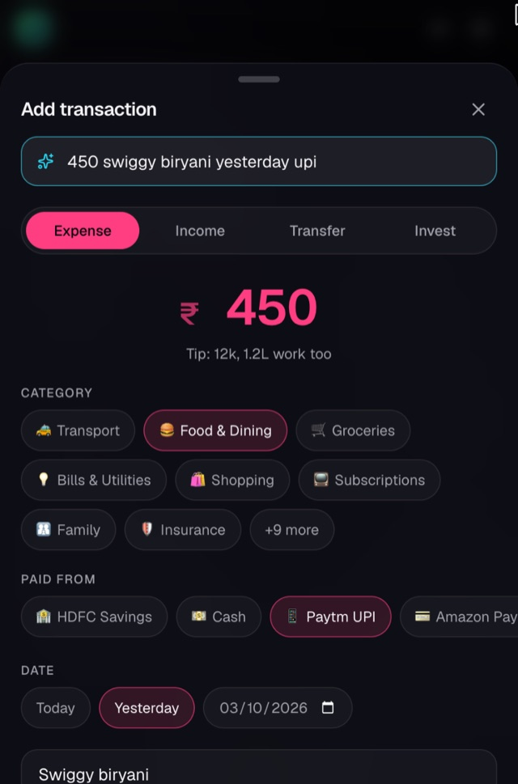
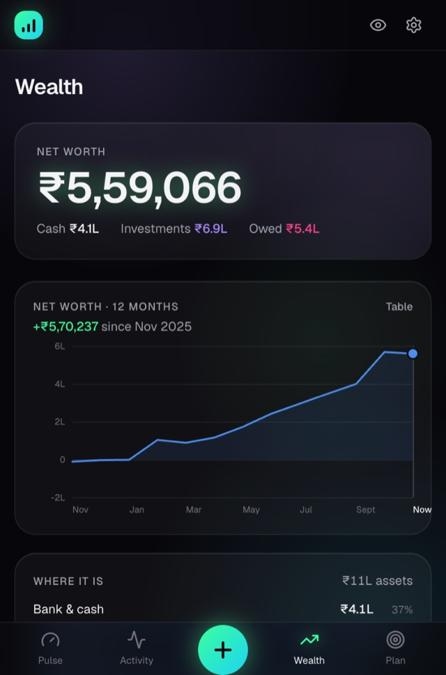
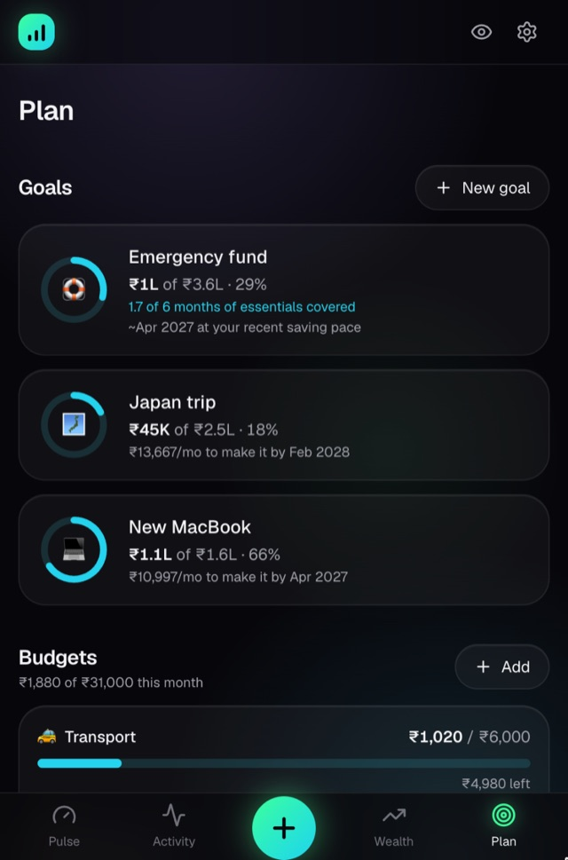
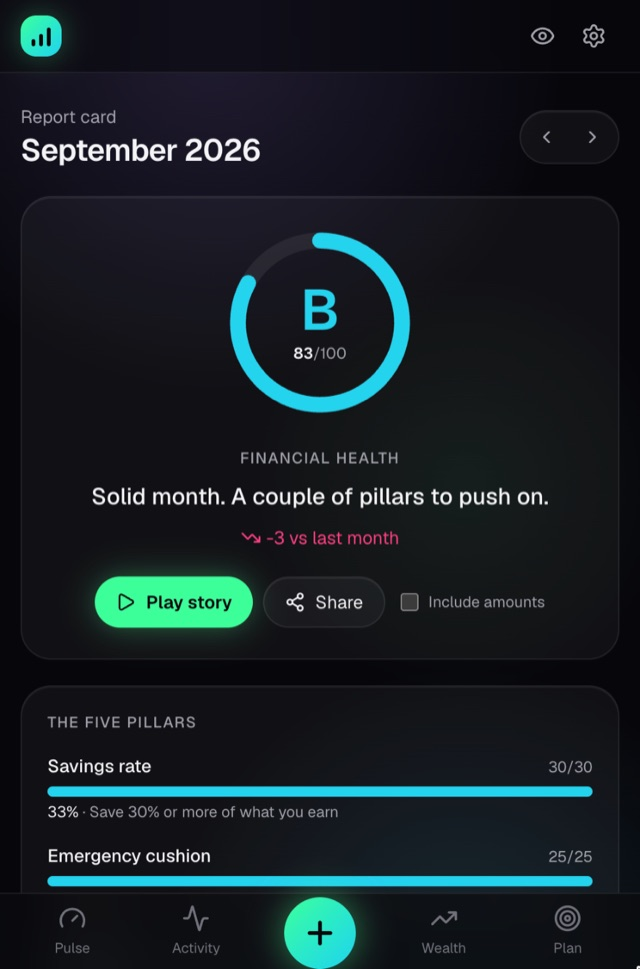

# Paisa

**Know where your money goes.** A simple, open-source money manager for your salary, spending, investments and savings, with a clear monthly picture of how you're doing. It runs in the browser and installs on your phone as an app (PWA). Built for India: rupees, lakhs and crores, payday-to-payday months, Indian bank statements and mutual funds.

<p align="center">
  
  
  
  
  
</p>

## What it does

- **Pulse.** Net worth, this month's income, spending, investments and savings at a glance, plus how much is **safe to spend per day** after bills and your savings target.
- **Log in two seconds.** Type `450 swiggy yesterday upi` and Paisa fills in the amount, category, account and date. Learns your merchants as you go.
- **Import bank statements.** CSV, XLS or XLSX from any Indian bank. Read in your browser, columns guessed for you, duplicates skipped, one-tap undo.
- **Recurring entries.** Salary, rent, SIPs and subscriptions log themselves, or wait for a one-tap confirm when the amount or date varies.
- **Wealth.** Mutual funds priced daily from AMFI (no API key), FDs with interest worked out, EPF/PPF/stocks/gold, grouped by the app or broker they're in. Credit card bills with due dates and limit usage, loans with EMI schedules, and a 12-month net-worth trend.
- **Plan.** Budgets that warn before you overspend, goals with "₹X a month to make it", and an emergency-fund target based on what you actually spend.
- **Monthly report card.** A health score across five pillars, insights in plain English, and a story you can share (amounts hidden unless you choose to show them).
- **Your data is yours.** It lives in your own database. Export everything as JSON or CSV, or delete your account, anytime. There's a one-tap "hide amounts" mode for using it in public.

## Run your own copy

Paisa is self-hosted: **your data lives in your own Supabase project** (the free tier is plenty), and only the emails you list can sign up.

### Option A: deploy (about 5 minutes, no terminal)

1. Create a free project at [supabase.com](https://supabase.com/dashboard).
2. Click the button below, then fill in the four env vars it asks for ([where to find them](docs/SELF_HOSTING.md#1-create-a-supabase-project)).

   [](https://vercel.com/new/clone?repository-url=https%3A%2F%2Fgithub.com%2Fkrishnaagrawal0402%2Fpaisa&env=NEXT_PUBLIC_SUPABASE_URL,NEXT_PUBLIC_SUPABASE_PUBLISHABLE_KEY,SUPABASE_DB_URL,ALLOWED_EMAILS&envDescription=Your%20Supabase%20project%20details%20and%20the%20emails%20allowed%20to%20sign%20up&envLink=https%3A%2F%2Fgithub.com%2Fkrishnaagrawal0402%2Fpaisa%2Fblob%2Fmain%2Fdocs%2FSELF_HOSTING.md&project-name=paisa&repository-name=paisa)

   The database is set up automatically during the build.

3. Do the one-time sign-in settings in [docs/SELF_HOSTING.md](docs/SELF_HOSTING.md#3-one-time-auth-settings).

### Option B: run locally

Needs Node.js 20.9+.

```bash
git clone https://github.com/krishnaagrawal0402/paisa && cd paisa
npm install
npm run setup            # asks for your Supabase details, writes .env.local, sets up the database
npm run dev              # → http://localhost:3000
```

Prefer everything on your machine? `npm run setup -- --local` runs Supabase in Docker instead.

### Try it with sample data

Sign in once, then fill your empty account with six months of realistic data (salary, rent, food, SIPs, a car loan, budgets and goals):

```bash
npm run db:seed-demo -- you@example.com          # add the demo data
npm run db:seed-demo -- you@example.com --wipe   # remove it again
```

It only fills an account that has no data yet, and `--wipe` only removes what it created.

## Development

| Command                              | What it does                                                         |
| ------------------------------------ | -------------------------------------------------------------------- |
| `npm run dev`                        | Start the app                                                        |
| `npm test`                           | Unit tests (Vitest)                                                  |
| `npm run lint` · `npm run typecheck` | Static checks                                                        |
| `npm run db:new <name>`              | Create a new migration in `supabase/migrations/`                     |
| `npm run db:deploy`                  | Apply migrations and sync `ALLOWED_EMAILS` to your database          |
| `npm run db:seed-demo -- <email>`    | Fill an empty account with sample data (`--wipe` to remove it again) |

Want to help? [CONTRIBUTING.md](CONTRIBUTING.md) explains how the code is laid out and the house rules. Adding your bank's statement format or a merchant you use is a great first PR.

**Stack:** Next.js 16 · TypeScript · Tailwind CSS 4 · Motion · Supabase (Postgres, Auth, row-level security, pg_cron) · Vercel

## Roadmap

Phase 1 (personal money management) is complete. **Phase 2** adds Splitwise-style shared expenses: groups, splits that work even with friends who never sign up, settling up, and your share flowing into your personal numbers. It's planned but not started; the brief is in [docs/PHASE2.md](docs/PHASE2.md).

## License

[MIT](LICENSE)
